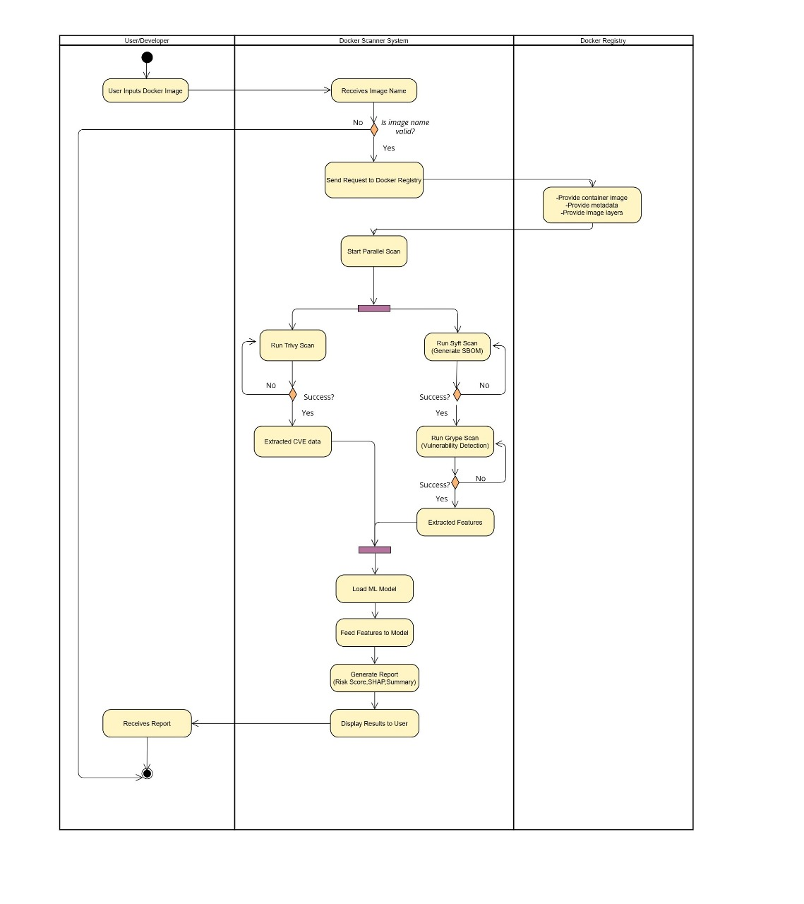
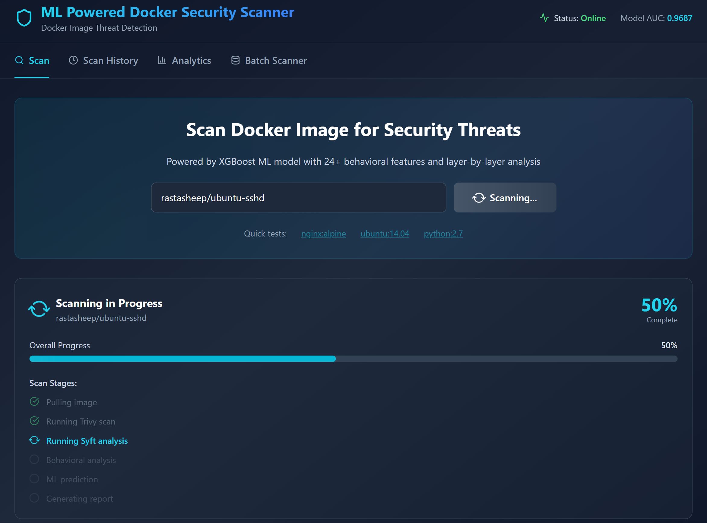

# eDockScan - ML-Driven Docker Security Scanner

A powerful, intelligent Docker image security vulnerability scanner powered by machine learning. eDockScan combines multiple security analysis tools (Trivy, Syft, Grype) with an XGBoost ML model trained on 24 behavioral features to detect vulnerabilities, secrets, risky configurations, and security anomalies in Docker images with 96.8% AUC accuracy.

## What is eDockScan?

eDockScan is an advanced Docker security analysis platform that goes beyond simple vulnerability scanning. It uses a sophisticated machine learning model to:

- **Detect Vulnerabilities** - Analyzes CVE databases with Trivy to identify known security issues
- **Extract & Analyze Packages** - Uses Syft to inventory all packages and dependencies
- **Evaluate Behavioral Patterns** - Examines 24 security-relevant features including layer deletions, temporary file activity, privilege escalation risks, and more
- **Predict Risk Scores** - Combines all signals into an ML-driven risk assessment (0-100 scale)
- **Generate Verdicts** - Classifies images as SAFE, SUSPICIOUS, or RISKY based on multiple factors
- **Provide Remediations** - Offers actionable recommendations for each identified issue

The system learns from patterns across hundreds of Docker images to make intelligent security decisions, not just pattern matching.

## Key Features

###  Comprehensive Scanning
- **Multi-Tool Analysis**: Combines Trivy (CVE scanning), Syft (package analysis), and Grype (vulnerability detection)
- **24-Feature Behavioral Analysis**: Evaluates security indicators including:
  - **Vulnerability Metrics**: CVE counts, severity distribution, outdated base images
  - **Configuration Risks**: Root user execution, exposed ports, hardcoded secrets
  - **Behavioral Patterns**: Layer deletions, temporary file usage, suspicious DNS queries
  - **Binary Analysis**: Stripped binaries, packed executables, entropy detection
  - **Security Posture**: SSH backdoors, process injection risks, privilege escalation patterns
  
- **Layer-by-Layer Analysis**: Breaks down risk by Docker layer to identify problem sources
- **Typosquatting Detection**: Identifies image names similar to legitimate registries

###  ML-Powered Intelligence
- **XGBoost Model**: Trained on 200+ Docker images
- **Proven Performance**: 96.87% AUC
- **Confidence Scoring**: Model confidence metrics for prediction reliability
- **Smart Classification**: Nuanced risk assessment vs. simple pass/fail verdict

###  Interactive Visualizations
- **Risk Gauge**: Color-coded risk visualization (Green=Safe, Amber=Suspicious, Red=Risky)
- **Vulnerability Donut**: Breakdown of CVE severity distribution
- **Behavioral Radar**: Multi-dimensional view of all 24 security features
- **Layer Risk Chart**: Bar chart showing risk distribution across image layers
- **Batch Comparison**: Compare multiple scan results side-by-side
- **Real-Time Progress**: Live scanning status with  analysis stages

### Advanced Capabilities
- **Batch Scanning**: Process multiple images in parallel with configurable workers
- **Scan History**: Track all scans with timestamps and trend analysis
- **Analytics Dashboard**: Aggregate statistics across all scans
- **PDF Reports**: Export professional security reports with:
  - Executive summary with verdict and risk score
  - All visualizations and charts
  - Detailed CVE findings with CVSS scores
  - Layer-by-layer analysis
  - Specific remediation recommendations
  - Best practice suggestions

###  Developer-Friendly
- **REST API**: Full-featured FastAPI backend at `/api/`
- **WebSocket Support**: Real-time progress updates during scans
- **CORS Enabled**: Works seamlessly from GitHub Codespaces


## Tech Stack

### Frontend
- **React 19.2.0** - Modern UI framework with hooks
- **Vite 7.2.2** - Ultra-fast build tool and dev server
- **TailwindCSS 3.4.18** - Utility-first CSS framework
- **Recharts 3.4.1** - React charting library for visualizations
- **Lucide React 0.554.0** - Beautiful icon library
- **jsPDF 3.0.4** - PDF generation library
- **html2canvas 1.4.1** - HTML to canvas/image conversion

### Backend
- **FastAPI** - Modern, fast Python web framework with async support
- **XGBoost** - Gradient boosting ML model (0.9687 AUC)
- **Trivy** - Open-source vulnerability scanner (remote mode)
- **Syft** - Container/image package analyzer
- **Grype** - CVES matching tool
- **Pydantic** - Data validation and settings management
- **Python 3.9+** - Language runtime


## Quick Start (GitHub Codespaces)

### Prerequisites
- GitHub Codespaces environment (pre-configured with Python, Node.js, Docker)
- Or local machine with: Python 3.9+, Node.js 18+, Docker

### 1. Clone and Navigate
```bash
git clone https://github.com/yourusername/edockscan.git
cd edockscan
```

### 2. Backend Setup (Terminal 1)

```bash
# Navigate to backend
cd backend

# Create and activate virtual environment
python -m venv venv
source venv/bin/activate  # Windows: venv\Scripts\activate

# Install Python dependencies
pip install -r requirements.txt

# Verify tools are installed
trivy version
syft version
grype version
```

### 3. Frontend Setup (Terminal 2)

```bash
# Navigate to frontend
cd frontend

# Install Node dependencies
npm install

# Start Vite dev server (runs on http://localhost:5173)
npm run dev
```

### 4. Start Backend API (Terminal 1)

```bash
# From backend directory with venv activated
cd backend

# Start FastAPI server (runs on http://localhost:8000)
# API will be available at http://localhost:8000
# Docs at http://localhost:8000/docs
python api.py
```

### 5. Access the Application

Open your browser and navigate to: **http://localhost:5173**

The frontend automatically proxies API calls to the FastAPI backend.


## Example Images to Test

### Safe Images (Good Reference Points)
```
nginx:alpine
python:3.11-slim
golang:1.22-alpine
node:20-alpine
redis:7.2
postgres:16-alpine
```

### Known Vulnerable Images (Test Detection)
```
ubuntu:14.04          # Outdated, many CVEs
python:2.7            # EOL version
node:10               # Outdated Node
debian:jessie         # Outdated Debian
nginx:1.16            # Outdated nginx
```

### Intentionally Vulnerable (Training Reference)
```
vulnerables/web-dvwa
bkimminich/juice-shop
```

## Architecture

### Frontend (`client/src/`)
```
App.jsx                          # Main React component with all tabs
├── Scan Tab                     # Single image scanning UI
│   ├── RiskGauge.jsx           # Circular gauge visualization
│   ├── VulnerabilityDonut.jsx  # CVE severity breakdown
│   ├── BehavioralRadar.jsx     # Multi-axis feature analysis
│   ├── LayerBarChart.jsx       # Per-layer risk view
│   └── PDFExport.jsx           # Report generation
├── History Tab                  # Browse previous scans
├── Analytics Tab                # Aggregate statistics
└── Batch Tab                    # Multi-image scanning
```


## Risk Score Interpretation

| Score Range | Verdict     | Color | Meaning |
|-------------|------------|-------|---------|
| 0-30       | SAFE       | Green | Low risk, safe to deploy |
| 30-70      | SUSPICIOUS | Amber | Moderate concerns, review needed |
| 70-100     | RISKY      | Red   | High risk, address issues before use |

## Configuration

### Scan Timeouts
- Single image: 300 seconds (configurable)
- Per image in batch: 300 seconds
- Overall batch timeout: Adjustable

### Parallel Workers
- Default: 3 concurrent scans
- Recommended max: 5 (system dependent)
- Adjust based on available CPU/memory

## Activity Diagram



## Snapshots

